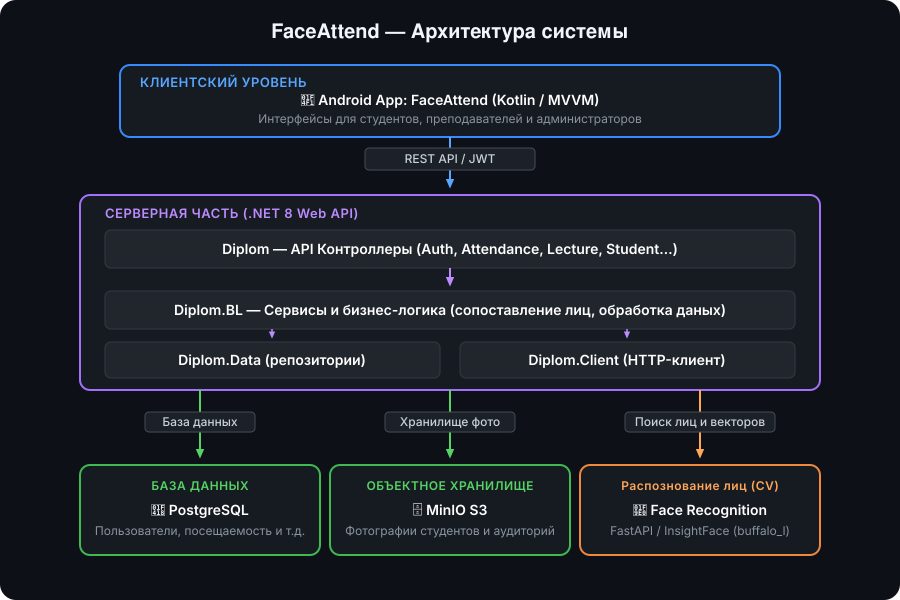

# FaceAttend — Система автоматизированного учёта посещаемости по распознаванию лиц

Система предназначена для автоматизации контроля посещаемости занятий студентами в учебных заведениях. Комплекс включает в себя мобильное приложение для студентов и преподавателей, серверную часть с бизнес-логикой и микросервис компьютерного зрения на базе нейросетей для распознавания лиц по фотографиям.

---

## 🏗 Архитектура системы

  

---

## 🧩 Компоненты проекта

### 1. `DiplomMobile/FaceAttend` — Мобильное приложение
* **Платформа:** Android (Kotlin, Gradle Kotlin DSL).
* **Архитектура:** MVVM (Model-View-ViewModel).
* **Возможности:**
  * Авторизация с разделением прав (Студент, Преподаватель/Лектор, Администратор).
  * Просмотр групп, курсов, предметов и расписания лекций.
  * Загрузка эталонных фотографий в профиль студента.
  * Преподавательский интерфейс: загрузка общей фотографии аудитории для автоматической фиксации присутствия.
  * Ручная отметка и аналитика посещаемости по занятиям.

### 2. `DiplonBack` — Основной бэкенд
* **Стек:** .NET 8 (C#), ASP.NET Core Web API, Entity Framework Core (Npgsql).
* **Слои решения:**
  * **Diplom** — REST API контроллеры (`Auth`, `Attendance`, `Lecture`, `Course`, `Subject`, `Student`, `Lector`, `Admin`), валидаторы FluentValidation, профили AutoMapper, конфигурация Swagger, Serilog, Identity.
  * **Diplom.BL** — бизнес-логика, управление пользователями, генерация JWT-токенов, интеграция с MinIO S3, алгоритм сопоставления векторов лиц по порогу евклидовой/косинусной дистанции (`DistanceOptions`).
  * **Diplom.Data** — модели сущностей (`Attendance`, `Lecture`, `Student`, `FaceEmbedding`, `FaceInfo` и др.), контекст `AppDbContext`, миграции и репозитории.
  * **Diplom.Client** — HTTP-клиент для взаимодействия с микросервисом нейросети.

### 3. `DiplonBack/Diplom.RecognazingService` — Сервис распознавания лиц
* **Стек:** Python 3.10+, FastAPI, Uvicorn.
* **Библиотеки CV/ML:** `InsightFace` (модель `buffalo_l`), `OpenCV`, `NumPy`, `ONNX Runtime`.
* **Функционал:**
  * Обнаружение (детекция) всех лиц на групповой фотографии аудитории.
  * Вычисление 512-мерных векторов признаков (эмбеддингов) для каждого лица.
  * Эндпоинты:
    * `POST /extract-embeddings` — извлечение векторов из переданного изображения.
    * `GET /health` — проверка работоспособности сервиса.

### 4. Данные
* **PostgreSQL:** реляционная база данных для хранения информации о пользователях, занятиях, оценках посещаемости и векторов лиц.
* **MinIO (S3):** защищенное хранилище исходных фотографий студентов и аудиторий.
